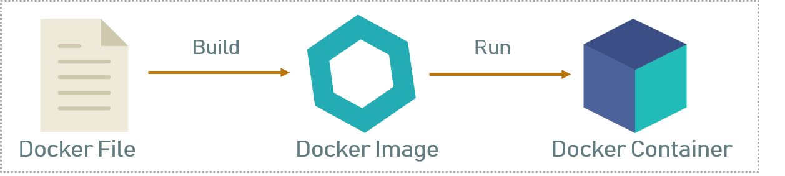
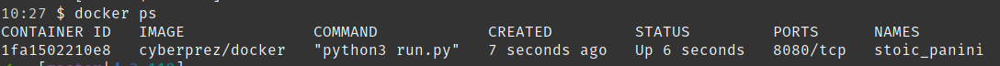

[comment]: # (THEME = solarized)
[comment]: # (CODE_THEME = zenburn)
[comment]: # (The list of themes is at https://revealjs.com/themes/)
[comment]: # (The list of code themes is at https://highlightjs.org/)
[comment]: # (Pass optional settings to reveal.js:)
[comment]: # (controls: true)
[comment]: # (controlsTutorial: true)
[comment]: # (keyboard: true)
[comment]: # (progress: true)
[comment]: # (slideNumber: true)
[comment]: # (showSlideNumber: 'all')
[comment]: # (markdown: { smartypants: true })
[comment]: # (hash: false)
[comment]: # (respondToHashChanges: false)
[comment]: # (Other settings are documented at https://revealjs.com/config/)

CyberPrez #01 - Docker
# Comprendre Docker

[comment]: # (!!!)

Le but de cette présentation est de faire découvrir Docker aux futurs utilisateurs. Il ne faut pas prendre cela pour un tutoriel dans un cadre professionnel.

En revanche, n'hésitez pas à partager et m'envoyer vos questions. Je mettrai le site à jour si nécéssaire :)

[comment]: # (!!!)

Mais avant de passer aux choses sérieuses :

# Qu'est ce que Docker? 

On va voir ça ensemble !

[comment]: # (!!!)
Docker est un système permettant de créer des conteneurs en y ajoutant une couche d'automatisation. <br> <br> 
*Pour savoir ce qu'est un conteneur, scroll en bas.*

[comment]: # (|||)

Il faut souvent comparer les conteneurs aux machines virtuelles pour comprendre. 


Une machine virtuelle nécéssite de *simuler* des composants virtuels <br> *(processeur, mémoire, disque, carte réseau)* pour qu'elle soit totalement indépendante. 

<br>
Cela permet d'avoir une machine indépendante presque aussi libre qu'un système réel. 


[comment]: # (|||)

Un conteneur utilise la para-virtualisation, c.a.d. que l'on va virtualiser uniquement **certains** composants. 

Ainsi, les conteneurs sont moins polyvalents (car dépendants de l'hôte), mais permettent de créer des "pseudos" machines-virtuelles avec peu de ressources *(puisque les conteneurs utilisent les composants physiques de la machine hôte)*.

[comment]: # (!!!)

<div style="font-size: 0.7em;">
Avec l'aide des différents outils autour de Docker, nous pouvons installer une application,<i> comme WordPress, Nextcloud, </i> et ce de manière quasiment automatique. <br>
L'idée est de se passer des démarches d'installation en les appliquant automatiquement dans un conteneur.
</div>

[comment]: # (!!! data-auto-animate)

<div style="font-size: 0.7em;">
Avec l'aide des différents outils autour de Docker, nous pouvons installer une application,<i> comme WordPress, Nextcloud, </i> et ce de manière quasiment automatique. <br>
L'idée est de se passer des démarches d'installation en les appliquant automatiquement dans un conteneur.
</div>

Une application complexe (serveur web, fichiers, base de donnée) s'installe donc en quelques secondes avec une unique commande.

[comment]: # (!!! data-auto-animate)

## à qui s'adresse Docker? 
- Aux developpeurs voulant simplifier la démarche d'installation de leurs programmes

  <!-- .element: style="height:20vh; image-rendering: crisp-edges;" -->

<div style="font-size: 0.6em;"> Les développeurs n'ont plus à créer des documentations longues et techniques pour déployer leurs programmes. <br> Ils peuvent également choisir la distribution qui accueillera le programme, ainsi un programme fonctionnant sous <b> Alpine </b> peut être déployé dans une instance <b> Debian ou Ubuntu </b> </div>


[comment]: # (!!! data-auto-animate)

## à qui s'adresse Docker? 
- Aux AdminSys voulant isoler les applications sur un même serveur (+ pour automatiser le déploiement d'une app)

  <!-- .element: style="height:20vh; image-rendering: crisp-edges;" -->

<div style="font-size: 0.5em;"> La conteneurisation permet d'avoir de nombreuses applications sans qu'elles ne puissent communiquer entre-elles (ou avec le système), ainsi que de déployer un grand nombre de services avec quelques commandes ! </div>

[comment]: # (!!! data-auto-animate)

## à qui s'adresse Docker? 
- Aux chefs de projets imposant un environnement proche du serveur de prod (ex: distribution, dépendances)

  <!-- .element: style="height:20vh; image-rendering: crisp-edges;" -->

<div style="font-size: 0.6em;"> Docker rentre dans la catégorie des outils permettant l'automatisation, il est courant que les projets imposants l'utilisent pour simplifier l'intégration du programme en cours de developpement </div>

[comment]: # (!!! data-auto-animate)

# Vous n'êtes pas perdu ? 

On va passer donc passer au concret !

[comment]: # (!!!)

# Résumé du moment 

Ce qu'il faut retenir de cette partie : 
- Un conteneur est une machine virtuelle plus légère, plus rapide, mais moins polyvalente <div style="font-size: 0.4em;"> du fait de la para-virtualisation </div>

[comment]: # (!!! data-auto-animate)

# Résumé du moment 

Ce qu'il faut retenir dans cette partie : 
- Un conteneur est une machine virtuelle plus légère, plus rapide, mais moins polyvalente <div style="font-size: 0.4em;"> grâce à la para-virtualisation </div>
- Docker permet d'installer une application facilement avec 1 commande <div style="font-size: 0.4em;"> car les conteneurs vont installer automatiquement la dite application </div>

[comment]: # (!!! data-auto-animate)
 
# Un peu de vocabulaire

<div style="font-size: 0.7em;"> Avant de passer aux choses sérieuses, nous devons parler la même langue. Voici donc les notions importantes à connaître avant d'aller dans le détail</div>

[comment]: # (!!! data-background-color="aquamarine")

## Qu'est ce qu'une image?

Une **image** est la base d'un conteneur. On appelle ça une image car elle est fixe, on ne peut la modifier. 
Lorsqu'on démarre un conteneur, celui-ci va partir d'une image pour démarrer. 

On peut donc résumer une image comme étant la base d'un conteneur Docker. 

 <div style="font-size: 0.6em;"> La suite, en bas </div>

[comment]: # (||| data-background-color="aquamarine" data-auto-animate)

## Qu'est ce qu'une image?

L'image contient l'application qui sera lancée lorsqu'un conteneur démarre à partir de cette image. <br>
On peut aisément créer notre propre image. <br> *Nous verrons ça plus tard*.

D'ailleurs l'aspect communautaire de Docker nous permet de récupérer les images d'autres personnes pour en faire des conteneurs.

[comment]: # (!!! data-background-color="aquamarine" data-auto-animate)

## Les Dockerfiles 

Si jamais vous ne souhaitez pas prendre l'image d'un inconnu, il est possible de créer **vos** images. <br>
Pour cela, nous allons parler de l'outil "Docker Build", qui repose sur des fichiers "**Dockerfile**"

 <div style="font-size: 0.6em;"> La suite, en bas </div>

[comment]: # (||| data-background-color="aquamarine")

Un Dockerfile est la "recette" pour créer une image. On choisi notre distribution comme 'couche de base', on y ajoute nos dépendances ainsi que les programmes nécéssaires au bon fonctionnement de l'application qu'on l'on souhaite dockeriser.

*Un exemple juste en dessous.*

[comment]: # (||| data-background-color="aquamarine")

## Exemple de Dockerfile

```yaml [1-1]
FROM httpd:2.4
RUN echo "Hello World" > /usr/local/apache2/htdocs/index.html 
EXPOSE 80
```
- Le FROM designe l'image de départ (qui sera téléchargée), on executera les commandes depuis celle-ci. 

[comment]: # (||| data-background-color="aquamarine" data-auto-animate)


## Exemple de Dockerfile

```yaml [2-2]
FROM httpd:2.4
RUN echo "Hello World" > /usr/local/apache2/htdocs/index.html 
EXPOSE 80
```
- Les instructions RUN permettent d'executer des commandes.

[comment]: # (||| data-background-color="aquamarine" data-auto-animate)

## Exemple de Dockerfile

```yaml [3-3]
FROM httpd:2.4
RUN echo "Hello World" > /usr/local/apache2/htdocs/index.html 
EXPOSE 80
```
- Le EXPOSE permet d'indiquer à Docker le port de l'application, c'est une instruction facultative.  

[comment]: # (||| data-background-color="aquamarine" data-auto-animate)

En se situant dans le répertoire du Dockerfile, nous pouvons sauvegarder l'image sur notre disque avec la commande suivante :  <br>

```bash
docker build -t exemple_nom_image .
```

[comment]: # (||| data-background-color="aquamarine")

### Sommes-nous obligé d'avoir une image pour lancer un conteneur ? 

Réponse simple : Oui <br> 
Mais.. il n'est pas obligatoire de créer l'image depuis un fichier Dockerfile ! 
En écrivant la commande.. <br> 
```bash 
docker pull hello-world
```
.. on récupère l'image depuis un serveur public nommé **DockerHub**. 
Les images de "base" dans les Dockerfile proviennent d'ailleurs de ce registre public

 <div style="font-size: 0.5em;"> Question : <i>"est-ce possible d'utiliser DockerHub en tant qu'utilisateur?"</i> en bas </div>

[comment]: # (||| data-background-color="aquamarine")

### Est-ce possible d'utiliser DockerHub en tant qu'utilisateur ?

 <div style="font-size: 0.7em;"> Il est également possible d'utiliser DockerHub pour son usage personnel, en revanche.. vous n'avez droit qu'à 1 image privée, vos autres images seront publiques et disponibles pour tous. <br> </div>
Les images publiques sont de forme suivante: <br>
<b>auteur</b>/<i>nom_depot</i> . <br>
Exemple d'image : linuxserver/booksonic <br> 
<div style="font-size: 0.6em"> L'image nommée <b> booksonic </b> sur le compte
de <b> linuxserver </b></div>

[comment]: # (||| data-background-color="aquamarine")

Vous pouvez récupérer cette image via la commande 
```bash
docker pull linuxserver/booksonic
```

[comment]: # (!!! data-background-color="aquamarine")

## Résumé de la creation d'un conteneur



[comment]: # (!!! data-background-color="aquamarine")

# Comment créer son propre conteneur ?

[comment]: # (!!! data-background-color="#fab1a0")

Nous allons créer notre conteneur de A à Z, avec une simple application Python. <br><br> 
Mais avant de commencer à créer notre image <br> 
*(qui est la première étape)* <br> Il faut programmer l'outil à conteneuriser ! 

[comment]: # (!!! data-background-color="#fab1a0")

### Notre programme

```Python
import bottle

@bottle.route('/')
def cyberprez():
  return "Hello World"

bottle.run(host='0.0.0.0', port=8080)
```

[comment]: # (!!! data-background-color="#fab1a0" data-auto-animate)

## Explication du programme Python

run.py
```Python [1-1]
import bottle

@bottle.route('/')
def cyberprez():
  return "Hello World"

bottle.run(host='0.0.0.0', port=8080)
```
- Nous utilisons la librairie Bottle.

[comment]: # (!!! data-background-color="#fab1a0" data-auto-animate)

## Explication du programme Python

run.py
```Python [3-5]
import bottle

@bottle.route('/')
def cyberprez():
  return "Hello World"

bottle.run(host='0.0.0.0', port=8080)
```
- Nous affichons le message "Hello World" en page d'accueil.

[comment]: # (!!! data-background-color="#fab1a0" data-auto-animate)

## Explication du programme Python

run.py
```Python [7-7]
import bottle

@bottle.route('/')
def cyberprez():
  return "Hello World"

bottle.run(host='0.0.0.0', port=8080)
```
- Et le serveur web est disponible sur le port 8080.

[comment]: # (!!! data-background-color="#fab1a0" data-auto-animate)

Nous allons donc créer un Dockerfile basique, permettant de lancer cette application : 

```Dockerfile
FROM debian:buster
RUN apt update
RUN apt-get -y install python3 python3-pip 
RUN python3 -m pip install bottle
EXPOSE 8080
WORKDIR /data
COPY run.py run.py
CMD ["python3", "run.py"]
```

 <div style="font-size: 0.5em;"> Explication détaillée du Dockerfile en bas</div>

[comment]: # (||| data-background-color="#fab1a0")

### Explication d'un Dockerfile

```Dockerfile [1-1]
FROM debian:buster
RUN apt update
RUN apt-get -y install python3 python3-pip 
RUN python3 -m pip install bottle
EXPOSE 8080
WORKDIR /data
COPY run.py run.py
CMD ["python3", "run.py"]
```
- Nous définisons l'image debian:buster en tant qu'image par défaut. 

<div style="font-size: 0.7em;"> Cela veut dire que nous partons d'une
distribution Debian 10. <br> Nous aurions aussi pu choisir Ubuntu, Centos ou
même Alpine en alternative. </div>


[comment]: # (||| data-background-color="#fab1a0" data-auto-animate)

```Dockerfile [2-4]
FROM debian:buster
RUN apt update
RUN apt-get -y install python3 python3-pip 
RUN python3 -m pip install bottle
EXPOSE 8080
WORKDIR /data
COPY run.py run.py
CMD ["python3", "run.py"]
```
- Installation des dépendances (Python, pip, et la librairie Bottle).


*Le nécéssaire pour lancer notre programme !*

[comment]: # (||| data-background-color="#fab1a0" data-auto-animate)


```Dockerfile [5-5]
FROM debian:buster
RUN apt update
RUN apt-get -y install python3 python3-pip 
RUN python3 -m pip install bottle
EXPOSE 8080
WORKDIR /data
COPY run.py run.py
CMD ["python3", "run.py"]
```
- On indique le port (optionnel) de sortie, pour accéder à l'application.
*Nous le repréciserons durant le lancement du conteneur à partir de notre image*


[comment]: # (||| data-background-color="#fab1a0" data-auto-animate)


```Dockerfile [6-7]
FROM debian:buster
RUN apt update
RUN apt-get -y install python3 python3-pip 
RUN python3 -m pip install bottle
EXPOSE 8080
WORKDIR /data
COPY run.py run.py
CMD ["python3", "run.py"]
```
- Nous nous plaçons dans l'emplacement /data **dans le conteneur** et nous y envoyons le fichier **run.py** qui se trouve à coté du fichier Dockerfile.

 <div style="font-size: 0.6em;"> Comme le conteneur est isolé du systeme (et donc des fichiers), il faut envoyer manuellement chaque dossier / fichier. Nous verrons dans un autre cas qu'il est aussi possible d'échanger des fichiers en dehors de la création de l'image.</div>


[comment]: # (||| data-background-color="#fab1a0" data-auto-animate)


```Dockerfile [8-8]
FROM debian:buster
RUN apt update
RUN apt-get -y install python3 python3-pip 
RUN python3 -m pip install bottle
EXPOSE 8080
WORKDIR /data
COPY run.py run.py
CMD ["python3", "run.py"]
```
- On donne la commande pour lancer notre programme lorsque l'image sera devenue un conteneur

[comment]: # (!!! data-background-color="#fab1a0" data-auto-animate)

### Créer notre image à partir du Dockerfile 

Votre Dockerfile est prêt, votre fichier run.py l'est aussi!<br>
Maintenant, nous pouvons créer notre image. 
<br>

Voici la commande : <br>
```bash
docker build -t cyberprez/docker . 
``` 

cyberprez/docker sera le nom de notre image (vous pouvez modifier le nom à votre guise). Nous allons voir comment en faire un conteneur !

[comment]: # (!!! data-background-color="#fab1a0")

### Créer un conteneur depuis notre image

Maintenant que notre image est créée, vous pouvez démarrer un conteneur à partir de celle-ci. Voici la commande à utiliser : <br>
```bash
docker run -d -i cyberprez/docker
```

Aucune erreur ? Tant mieux ! 
Vous pouvez voir que le conteneur est bien lancé avec la commande : <br>
```bash
docker ps
```


[comment]: # (||| data-background-color="#fab1a0")




Le nom du conteneur sera différent, si on ne le précise pas manuellement car Docker va générer un nom aléatoire.

[comment]: # (!!! data-background-color="#fab1a0")

Mais nous n'avons pas accès au site de notre application Python ...

[comment]: # (!!! data-background-color="#fab1a0")

Pour y avoir accès, il faut dire à Docker que le port 8080 de notre conteneur est relié à notre machine !

Nous devons relancer notre conteneur en lui précisant ces paramètres !

[comment]: # (!!! data-background-color="#fab1a0")

### Arreter notre conteneur

En utilisant `docker ps` (*comme sur la page 24.1*)
Récuperez l'ID de votre conteneur, (*__1fa1502210e8__* dans mon cas).

Arrêtez le et supprimez le comme dans l'exemple suivant : 
```bash
docker stop 1fa1502210e8
docker rm 1fa1502210e8
``` 

[comment]: # (!!! data-background-color="#fab1a0")

### Relancer notre conteneur avec le bon port

Nous allons rajouter l'option `-p` qui permet de mapper un de nos ports à celui
de notre conteneur.

```bash
docker run -d -p 8070:8080 -i cyberprez/docker
```

Ainsi, le port 8070 *de notre machine* est relié au port 8080 *du conteneur*. 

Nous aurions pu mettre le même port (8080:8080), vous êtes libre de choisir le port *de votre machine* (notre app utilise uniquement le port 8080 dans le conteneur)

[comment]: # (!!! data-background-color="#fab1a0")

Et tadaaaaa ! Votre site est disponible via l'URL : http://127.0.0.1:8070 ! 

[comment]: # (!!! data-background-color="#fab1a0")

 Maintenant que vous semblez à l'aise, nous allons supprimer ces vilaines commandes indigestes *(Docker run, Docker Build)* pour découvrir **docker-compose**

 
[comment]: # (!!! data-background-color="#fab1a0")

### Qu'est ce que Docker-compose? 

docker-compose est un moyen de remplacer une longue commande par un fichier.
Par exemple, la commande suivante : 
```bash
docker run -d -p 8070:8080 -i cyberprez/docker
```

devient le fichier : 

```yml
version: '3.3'
services:
    cyberprez:
        ports:
            - '8070:8080'
        image: cyberprez/docker
```
Pour lancer notre conteneur, il suffira de faire `docker-compose up -d`

[comment]: # (!!! data-background-color="#fab1a0")
Si vous avez une erreur, c'est peut-être parce que le conteneur que vous aviez
lancé juste avant est toujours actif, il vous faudra l'arreter. 

Une fois la commande `docker-compose up -d`, vous remarquerez que votre site
est de nouveau disponible !


[comment]: # (!!! data-background-color="#fab1a0")

Maintenant.. Nous allons passer à la prochaine notion : 

# Les Volumes

[comment]: # (!!! data-background-color="#f1c40f")

Lorsque l'on lance un conteneur, celui-ci se crée à partir d'une image (qui elle, ne change pas).

Ainsi, en relançant le conteneur, il va se recréer à partir de la même image. 
Les données sauvegardées sont donc supprimées ! 

Un volume permet de garder ces fichiers sur votre système, et de les
ré-injecter à la recréation du conteneur. 

[comment]: # (!!! data-background-color="#f1c40f")

Au lieu de partir de 0, nous allons utiliser un conteneur sur DockerHub. 
Prennons un exemple simple: Homer. 

Homer est une application permettant de créer un petit "panel" pour afficher de nombreux liens sous forme de boutons.

[comment]: # (!!! data-background-color="#f1c40f")

Exemple de Homer:


<a href="https://github.com/bastienwirtz/homer"> Lien du Projet Github </a>


[comment]: # (!!! data-background-color="#f1c40f")

Mais... Homer stocke sa configuration dans un dossier stocké dans **/www/assets** alors, même si nous arrivons à le modifier : la configuration sera reintialisée à chaque démarrage du conteneur !

*Sauf avec un volume !*

[comment]: # (!!! data-background-color="#f1c40f")

Voici le volume qui récupère l'image de Homer (*b4bz/homer*).  

```yaml [6-7]
version: "2"
services:
  homer:
    image: b4bz/homer
    container_name: homer
    volumes:
      - ./data:/www/assets
    ports:
      - 8080:8080
```

On remarque qu'il y a un emplacement qui correspond au volume ! 

[comment]: # (!!! data-background-color="#f1c40f")

Cet emplacement permet de modifier la configuration de Homer et également de la
conserver si jamais on relance le conteneur !

[comment]: # (!!! data-background-color="#f1c40f")

### Un mot pour la fin ?  

Maintenant, vous savez créer un conteneur Docker à partir d'une image que vous avez créée .. ou récupérée depuis internet. Vous savez également conserver vos fichiers de configuration qui seront essentiels pour la sauvegarde ou la migration de votre conteneur. 

Félicitation d'avoir tenu jusqu'au bout ! Ces compétences vous serviront dans de nombreux domaines.
[comment]: # (!!!) 

Libre à vous d'expérimenter et de continuer à apprendre autour de Docker ! 
J'espère que vous aurez appris de nombreuses choses et n'hésitez pas à partager
cette présentation pour continuer à propager Docker ! 

[comment]: # (!!!)

Pour aller plus loin : 

- [Docker Swarm](https://thebidouilleur.xyz/posts/DockerSwarm/) 
- [CICD Via Docker](https://www.drone.io//)
 
